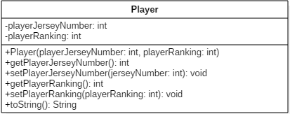

# Major-Program-1-Spring-2020
## COMP 167 Spring 2019
### Due Febuarary 27th 2019 @ 8:00 pm
#### Submissions that are late are deducted 10 points each day they are late. After 3 days of being late the grade will be an automatic 0.

##  Introduction

This program will store roster and rating information for a soccer team. Coaches rate players during tryouts to ensure a balanced team.

## Git and GitHub

You will submit this project using GitHub pull requests. You **must** create a GitHub pull request for each level to receive credit. You should request your assigned reviewer on your pull request. Review the following resource on git and GitHub for major programs _before_ you start work:

- [Written Explanation](https://gist.github.com/ccannon94/511115be821a873ae9ec5f4db9cfdda0)
- [YouTube Video](https://www.youtube.com/watch?v=l2bP9JKQkdA)

You **must** complete all work on a separate branch. You CAN NOT push code to the master branch. Review the above git and GitHub resources to learn about branching.

You **must** add your assigned TA as a reviewer for your pull requests. You can find your assigned reviewer [here](./assigned-reviewers.csv). 

## Class UMLs




## Classes

You are required to implement all of the classes listed  above. Below are additional details that could provide some help for certain classes.

### Player Class

This class is to be a reprensentation of a Soccer Player. The toString method will return a player's Jersey and then their ranking like in the example below.

#### Example
```
 Jersey number: 84, Rating: 7
```

### RosterGenerator Class

This class will contain your main method as well as methods for handling various functions.


## Grading

If your project does not compile, it receives a grade of zero. 

### Level 1 (10 points)
Create the Player Class

### Level 2 (20 points)
Create the RosterGenerator Class. The array should be Prompt the user to input five pairs of numbers: A player's jersey number (0 - 99) and the player's rating (1 - 9). After getting that player's jersey number and rating make create a Player object with that info and add it to the array. Make sure that there are no duplicate jersey numbers and that there is error handling for if a user does not input the required info.
EX:
```
Enter player 1's jersey number:
84
Enter player 1's rating:
7

Enter player 2's jersey number:
23
Enter player 2's rating:
4

Enter player 3's jersey number:
4
Enter player 3's rating:
5

Enter player 4's jersey number:
30
Enter player 4's rating:
2

Enter player 5's jersey number:
66
Enter player 5's rating:
9

```

### Level 3 (10 points)
Implement a menu of options for a user to modify the roster. Each option is represented by a single character. The program initially outputs the menu, and outputs the menu after a user chooses an option.  The program ends when the user chooses the option to Quit. For this step, the other options do nothing
EX:
```
MENU
u - Update player rating
a - Output players above a rating
r - Replace player
o - Output roster
q - Quit

Choose an option: 
```

### Level 4 (5 points)
Implement the "Output roster" menu option.
EX:
```
ROSTER
Player 1 -- Jersey number: 84, Rating: 7
Player 2 -- Jersey number: 23, Rating: 4
...
```

### Level 5 (20 points)
Implement the "Update player rating" menu option. Prompt the user for a player's jersey number. Prompt again for a new rating for the player, and then change that player's rating
EX:
```
Enter a jersey number:
23
Enter a new rating for player:
6
...
```
### Level 6 (15 points)
Implement the "Output players above a rating" menu option. Prompt the user for a rating. Print the jersey number and rating for all players  with ratings above the entered value. 

EX:
```
Enter a rating:
5

ABOVE 5
Player 1 -- Jersey number: 84, Rating: 7
...
```
### Level 7 (20 points)
Implement the "Replace player" menu option. Prompt the user for the jersey number of the player to replace. If the player is in the roster, then prompt again for a new jersey number and rating. Update the replaced player's jersey number and rating. Make sure there are no duplicate jersey numbers in the roster and make sure the user can only enter in the ranges for jersey number and rating.

EX:
```
Enter a jersey number:
4
Enter a new jersey number:
12
Enter a rating for the new player:
8
```
